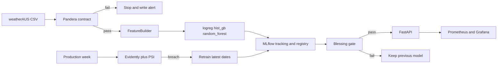

# RainGuard รายงานโครงงานกลุ่มหลอ

รายวิชา CP413008 Machine Learning Engineering for Production
ภาคเรียนที่ 1/2569

- กลุ่ม 2 ชื่อกลุ่ม หลอ
- สมาชิก: จักรภัทร เวียงสิมมา 673380308-6 sec 1, สรวิศ สำราญบึงแก 673380348-4 sec 1, พรหมพัฒน ศิริภัคกุลวัฒน์ 673380328-0 sec 2
- นำเสนอ 12 ตุลาคม 2569 เวลา 09:20–09:40 ห้อง 9226 (พูด 12 นาที ถามตอบ 3 นาที)

ระบบนี้พยากรณ์ว่าวันพรุ่งนี้จะมีฝนหรือไม่ จากข้อมูลอากาศของวันนี้ เพื่อให้เกษตรกรตัดสินใจพ่นสาร ให้น้ำ หรือเลื่อนเก็บเกี่ยวก่อนออกจากบ้าน

## สถาปัตยกรรม

คำสั่งเดียวจากไฟล์ดิบถึงโมเดลที่พร้อมเสิร์ฟคือ `python -m rainguard.cli run` DAG `rainguard_train` เรียกฟังก์ชันชุดเดียวกัน และตั้งเวลาทุกวันจันทร์ 06:00

## 1. การวางกรอบปัญหา

### AI Project Canvas

- ปัญหา: เกษตรกรต้องรู้ก่อนเช้าว่าวันพรุ่งนี้ฝนจะตกหรือไม่ ถ้าพ่นสารแล้วฝนตก ยาจะถูกชะล้าง ถ้าเลื่อนเก็บเกี่ยวทั้งที่ไม่มีฝน จะเสียวันทำงาน
- ผู้ใช้: เกษตรกรหรือสหกรณ์ที่เช็กสถานีอากาศของแปลงตัวเอง
- การทำนาย: ความน่าจะเป็นที่ `RainTomorrow = Yes` จากอุณหภูมิ ความชื้น ฝนวันนี้ ความกดอากาศ ลม เมฆ และสถานี
- การกระทำ: ถ้าความน่าจะเป็นเกิน threshold ให้ `delay_spray_and_cover_harvest` ถ้าไม่เกิน ให้ `proceed_field_work`
- ข้อมูล: ไฟล์สาธารณะ weatherAUS จาก `https://rattle.togaware.com/weatherAUS.csv` ดาวน์โหลดวันที่ 5 ตุลาคม 2569 ได้ 275,410 แถว ช่วงวันที่ 2007-11-01 ถึง 2026-01-30
- คุณค่า: ลดครั้งที่พ่นสารแล้วฝนชะล้าง และลดครั้งที่เลื่อนงานทั้งที่ท้องฟ้าแจ่ม
- ความเสี่ยง: พลาดฝนมีต้นทุนสูงกว่าเตือนผิด ข้อมูลสถานีเปลี่ยนตามฤดู และคอลัมน์ `RISK_MM` เป็นปริมาณฝนของวันพรุ่งนี้ ถ้าเผลอใช้จะทำให้ตัวเลขดีปลอม
- วงรอบ feedback: วันถัดไปมีป้ายจริง ระบบเทียบ recall จริงกับข้อมูลอ้างอิง ถ้าอินพุตเลื่อนหรือความสัมพันธ์ป้ายเปลี่ยน จะเทรนใหม่

ทำไมต้องเป็นโมเดล ไม่ใช่กฎคงที่: ฝนเกิดจากความชื้น ความกดอากาศ ลม เมฆ และสถานีพร้อมกัน กฎอย่าง "ความชื้นเกิน 80 แล้วเตือน" จับปฏิสัมพันธ์เหล่านี้ไม่ได้ และความสัมพันธ์เปลี่ยนตามปี ตัวเลขด้านล่างแสดงว่าโมเดลที่เก่งกว่า baseline ลดต้นทุนบนชุดอนาคตได้จริง

### ตัวชี้วัด

ต้นทุนธุรกิจกำหนดให้พลาดฝน 5 หน่วย และเตือนผิด 1 หน่วย เพราะยาที่ถูกชะล้างแพงกว่าการเลื่อนงานหนึ่งวัน

- Optimizing metric: ROC-AUC บนชุดทดสอบที่เป็นช่วงเวลาอนาคต
- Threshold: เลือกบนชุดตรวจสอบให้ต้นทุนรวมต่ำสุด โดย recall ของคลาสฝนบนชุดตรวจสอบต้องไม่ต่ำกว่า 0.72
- Gating ก่อนขึ้น Production: ROC-AUC อย่างน้อย 0.75, recall บนชุดทดสอบอย่างน้อย 0.70, ขนาดบันเดิลไม่เกิน 25 MB, latency p95 ไม่เกิน 150 ms, p50 ไม่เกิน 100 ms, throughput ไม่ต่ำกว่า 10 คำขอต่อวินาที
- โมเดลที่ไม่ดีกว่า logistic regression จะไม่ถูกเลือก แม้จะผ่าน recall

บนชุดทดสอบ 42,019 วัน มีฝน 8,644 วัน ถ้าไม่เตือนเลย ต้นทุนคือ 8,644 คูณ 5 เท่ากับ 43,220 ถ้าเตือนทุกวัน ต้นทุนคือ 33,375 โมเดลที่เลือกจ่าย 15,004 จึงถูกกว่าทั้งสองกฎนี้

## 2. ข้อมูลและการตรวจสอบ

แยกตามวัน ไม่สุ่ม เพราะโจทย์คือการพยากรณ์อนาคต วันเดียวกันไม่อยู่ในสองชุด

- ฝึก: ถึง 2021-01-02 จำนวน 183,841 แถว อัตราฝน 0.216
- ตรวจสอบ: ถึง 2023-07-18 จำนวน 41,457 แถว
- ทดสอบ: ถึง 2026-01-30 จำนวน 42,019 แถว
- ทิ้งแถวที่ไม่มีป้าย 8,093 แถว
- ทิ้ง `RISK_MM` ก่อนเข้าฟีเจอร์

สัญญาข้อมูลอยู่ใน `src/rainguard/schema.py` และถูกเขียนซ้ำที่ `artifacts/schema.json` ทุกครั้งที่รัน ขอบเขตเป็นขีดจำกัดทางกายภาพ เช่น ฝนรายวันติดลบไม่ได้ ความชื้นอยู่ระหว่าง 0 ถึง 100 ความกดอากาศอยู่ระหว่าง 970 ถึง 1050 ไม่ใช้ค่าต่ำสุดสูงสุดของตัวอย่าง เพราะฤดูที่ฝนมากกว่าเดิมยังเป็นข้อมูลถูก

ค่าหายหลัก ๆ คือการระเหย 58.1 เปอร์เซ็นต์ และชั่วโมงแสงแดด 62.1 เปอร์เซ็นต์ `FeatureBuilder` เติมมัธยฐานที่ fit จากชุดฝึกเท่านั้น และเติมตัวบอกว่าค่าเดิมหายสำหรับสองคอลัมน์นี้รวมถึงเมฆเช้าและเมฆบ่าย จากนั้นใส่เดือนกับลำดับวันในปี แล้ว scale และ one-hot ออบเจกต์นี้ถูกบันทึกในบันเดิลเดียวกับโมเดล ทั้งตอนเทรนและตอน API เรียกตัวเดียวกัน แถวจึงให้เวกเตอร์เดียวกับตอนอยู่ในชุด ทดสอบนี้อยู่ใน `tests/test_data.py`

ถ้าป้อนข้อมูลเสีย ระบบหยุดก่อนเทรนและเขียน `alerts/validation_error.txt` ตัวอย่างที่ทำให้หยุดคือฝนติดลบ ความชื้น 150 ป้าย `Maybe` และสถานีว่าง API ทำแบบเดียวกัน: `/predict` ที่ฝนเป็น -5 ได้สถานะ 422 และ `decision = rejected_by_schema_gate` โดยไม่เรียกโมเดล นี่คือ cascade ชั้นตรวจสัญญาก่อนโมเดล

## 3. โมเดล

ทั้งสามตัวใช้ฟีเจอร์ชุดเดียวกัน บันทึกไว้ที่ `reports/experiments.json`

- logreg: Logistic Regression, `class_weight=balanced`, max_iter 400 เป็น baseline
- hist_gb: HistGradientBoosting 150 รอบ, learning rate 0.08, น้ำหนักตัวอย่างถ่วงคลาสฝน
- random_forest: 40 ต้น, ความลึก 10, `class_weight=balanced_subsample`

ผลบนชุดทดสอบช่วง 2023-07-19 ถึง 2026-01-30

- logreg: ROC-AUC 0.8712, recall 0.8537, precision 0.4291, ต้นทุน 16,143, FP 9,818, FN 1,265, threshold 0.39, ขนาด 0.01 MB, ผ่านด่านแต่ไม่ถูกเลือก
- hist_gb: ROC-AUC 0.8877, recall 0.8246, precision 0.4898, ต้นทุน 15,004, FP 7,424, FN 1,516, threshold 0.45, ขนาด 0.58 MB, ถูกเลือกเพราะ AUC สูงสุดในกลุ่มที่ผ่านด่าน และดีกว่า baseline 0.0165
- random_forest: ROC-AUC 0.8563, recall 0.8348, precision 0.4158, ต้นทุน 17,279, FP 10,139, FN 1,428, threshold 0.41, ขนาด 3.23 MB, ไม่ผ่านเพราะ AUC ต่ำกว่า logistic regression

hist_gb พลาดฝนมากกว่า logreg เล็กน้อย แต่เตือนผิดน้อยลงมาก ต้นทุนรวมจึงต่ำกว่า เลยเลือกตัวนี้ ไม่ได้เลือกจาก accuracy ก้อนเดียว

slice ตามเดือนบนชุดทดสอบยังอยู่เหนือ recall 0.77 ทุกเดือน เดือนที่ AUC สูงสุดคือพฤษภาคม 0.917 และเดือนที่ต่ำสุดคือพฤศจิกายน 0.860 ดู `reports/slice_by_month.json`

## 4. การติดตามการทดลองและทะเบียนโมเดล

ทุกการทดลองใน MLflow เก็บครบหกอย่าง

- เวอร์ชันโค้ด: git SHA ในแท็ก `code_version` รอบที่วัดในรายงานนี้บันทึกเป็น `unknown` เพราะยังไม่ได้ init git ตอนเทรน ค่าแฮชของคอมมิตที่ส่งงานอยู่ในประวัติ git ของรีโปนี้
- เวอร์ชันข้อมูล: SHA-256 ของไฟล์ดิบ `6598e6857fb13aa46b3b41fec849f94e6884d30a7f8696455c433b9378b549fc` พร้อมจำนวนแถวและวันตัดชุด
- ไฮเปอร์พารามิเตอร์: บันทึกเป็น params ของแต่ละ run
- ตัวชี้วัด: ROC-AUC, average precision, recall, precision, F1, ต้นทุน, เวลาเทรน, ขนาดไฟล์
- ไฟล์ผลลัพธ์: estimator ใน MLflow และ `serving_bundle.joblib` ที่รวมโมเดลกับ FeatureBuilder
- สภาพแวดล้อม: Python 3.12.5, pandas 2.3.3, numpy 2.5.3, scikit-learn 1.9.1, mlflow 2.22.5, Windows 11

ทะเบียนชื่อ `rainguard`

- เวอร์ชัน 1 logistic regression
- เวอร์ชัน 2 hist_gb จากข้อมูลเต็ม เป็นตัวที่เสิร์ฟตอนสาธิต
- เวอร์ชัน 3 random forest ไม่ได้ขึ้น Production
- เวอร์ชัน 4 hist_gb ที่เทรนใหม่จากช่วงวันล่าสุดหลังเจอ drift AUC 0.8880 recall 0.8638 บนหน้าต่างทดสอบของมันเอง ผ่านด่านเลยถูกโปรโมตชั่วคราว

การย้อนกลับรันด้วย `python scripts/rollback.py` ย้าย alias `production` จากเวอร์ชัน 4 กลับไปเวอร์ชัน 2 แล้วโหลดบันเดิลเดิมขึ้น API `/health` หลังย้อนกลับตอบ `model_version = 2` หลักฐานอยู่ใน `reports/rollback.json`

## 5. การให้บริการ

รูปแบบที่เลือกคือ synchronous real-time API เกษตรกรเช็กทีละแปลงตอนเช้า และเกณฑ์ของวิชาต้องการ latency ของระบบที่ตอบทันที งานพยากรณ์ทั้งภูมิภาคตอนกลางคืนเป็น batch ได้ แต่ไม่ได้เป็นเส้นทางที่ทำให้วัด p50 กับ p95 ของคำขอเดียว

API รันด้วย FastAPI ในคอนเทนเนอร์ `rainguard-api` จาก `Dockerfile` และ `docker-compose.yml` เรียกจากนอกคอนเทนเนอร์ที่ `http://127.0.0.1:8000` ได้จริง `GET /health` ตอบ `hist_gb` เวอร์ชัน 2 และ `POST /predict` ที่ฝนติดลบได้ 422 `rejected_by_schema_gate`

เอนด์พอยต์

- `GET /health` สถานะ ชื่อโมเดล เวอร์ชัน threshold และ SLO
- `POST /predict` รับค่าอากาศดิบ ไม่รับเวกเตอร์ที่แปลงแล้ว
- `GET /metrics` เมตริก Prometheus

โหลดเทสยิงเข้าคอนเทนเนอร์นี้ 200 คำขอ ตามด้วย 160 คำขอแบบ 8 เธรด ผลใน `reports/slo.json` ตอนโมเดลเวอร์ชัน 2

- p50 41.2 ms ผ่านเกณฑ์ 100 ms
- p95 68.1 ms ผ่านเกณฑ์ 150 ms
- throughput 20.30 คำขอต่อวินาที ผ่านเกณฑ์ 10

รอบที่วัดด้วย uvicorn บนโฮสต์ก่อนเปิด Docker เก็บไว้ที่ `reports/slo_host.json` คือ p50 62.2 ms, p95 84.2 ms, throughput 15.36 คำขอต่อวินาที และผ่านเกณฑ์เดียวกัน

Prometheus scrape `/metrics` และ Grafana มีแดชบอร์ด RainGuard อัลลาร์มครอบ latency p95, คำขอที่สัญญาปฏิเสธ, drift share และ recall จริง

## 6. การเฝ้าระวังและการเทรนใหม่

Data drift คือการกระจายของอินพุตเปลี่ยน ส่วน concept drift คืออินพุตยังเหมือนเดิมแต่ความสัมพันธ์กับป้ายแย่ลง ถ้า drift share ถึง 0.30 ระบบเรียกว่า data drift แม้ recall จะยังสูง ถ้า drift share ต่ำกว่า 0.30 แต่ recall จริงต่ำกว่า 0.60 ระบบเรียกว่า concept drift

เครื่องมือคือ Evidently DataDriftPreset ร่วมกับ PSI ที่อธิบายได้เอง รอบสาธิตทั้งสองวิธีให้สัดส่วนเท่ากัน

- สัปดาห์ปกติ: drift share 0.000, recall 0.824, ชนิด stable
- อินพุตถูกเลื่อนแต่ค่ายังอยู่ในสัญญา: drift share 0.524 จาก 11 คอลัมน์, recall 0.998, ชนิด data drift, สั่งเทรนใหม่
- พลิกป้าย 45 เปอร์เซ็นต์สองหน้าต่าง โดยไม่เลื่อนอินพุต: drift share 0.000, recall 0.380 และ 0.389, ชนิด concept drift, สองหน้าต่างติดกันจึงสั่งเทรนใหม่

นโยบาย: เทรนใหม่ทุกวันจันทร์ 06:00 หรือทันทีที่ drift share ถึง 0.30 หรือ recall จริงต่ำกว่า 0.60 สองหน้าต่างติดกัน รอบสาธิตเทรน hist_gb ใหม่บน 40 เปอร์เซ็นต์ของวันล่าสุด ได้เวอร์ชัน 4 และโปรโมตเพราะยังผ่านด่านเมื่อเทียบกับ AUC ของตัวที่เสิร์ฟอยู่ จากนั้นย้อนกลับไปเวอร์ชัน 2 เพื่อโชว์ว่า alias เปลี่ยนได้โดยไม่ลบของเก่า

### CI/CD

GitHub Actions ใน `.github/workflows/ci.yml` แยกสามงาน

- คุณภาพโค้ดด้วย ruff
- สัญญาข้อมูลด้วย `tests/test_data.py` และ `tests/test_monitoring.py` รวมขั้นที่ไฟล์เสียต้องถูกปฏิเสธ
- คุณภาพโมเดลด้วย `tests/test_model.py` และ `tests/test_serving.py` โมเดลบนข้อมูลสังเคราะห์ต้องผ่าน AUC 0.75 และ recall 0.70

หลักฐานบนเครื่องอยู่ใน `reports/ci_pass.txt` และ `reports/ci_fail.txt` ไฟล์หลังคือการยิง `python -m rainguard.cli validate` ใส่ข้อมูลที่ฝนติดลบ แล้วกระบวนการจบด้วยรหัสไม่ใช่ 0 งาน CI ถือว่ารอบนี้ผ่านก็ต่อเมื่อเกตปฏิเสธไฟล์เสียได้

หลักฐานบน GitHub Actions

- รอบที่ผ่านบน `main` หลังรวมผลจากคอนเทนเนอร์: https://github.com/ppppppwaqrd/CP413008-rainguard/actions/runs/37350589337 งานคุณภาพโค้ด สัญญาข้อมูล และคุณภาพโมเดลผ่านทั้งสามงาน
- รอบที่ไม่ผ่านคือ Pull Request ที่ลดขอบล่างของปริมาณฝนจาก 0 เป็น -10 ทำให้ค่า -5 ไม่ถูกปฏิเสธ งานสัญญาข้อมูลและงานคุณภาพโมเดลเป็นสีแดง: https://github.com/ppppppwaqrd/CP413008-rainguard/pull/5 และ https://github.com/ppppppwaqrd/CP413008-rainguard/actions/runs/37350815364 Pull Request นี้ไม่ถูก merge `main` ยังปฏิเสธฝนติดลบ

## 7. Pipeline การทำซ้ำ และ Git

`execute_run` ทำตามลำดับ example, statistics, schema, validate, transform, train, evaluate, blessing, push หรือ skip ถ้าสัญญาไม่ผ่านจะไม่มีการเทรน DAG ใน `dags/rain_train.py` เรียงงานเดียวกัน และแยกสาขา pusher กับ skip_push

คนอื่นรันจากเครื่องเปล่าตาม README: สร้าง virtualenv, `pip install -e ".[dev]"`, `python scripts/download_data.py`, แล้ว `python -m rainguard.cli run` เวอร์ชันไลบรารีถูกล็อกใน `requirements.txt`

รีโปที่ส่งอยู่ที่ https://github.com/ppppppwaqrd/CP413008-rainguard สาขา `main`

Pull Request ที่ merge แล้ว

- https://github.com/ppppppwaqrd/CP413008-rainguard/pull/1 สัญญาข้อมูลและตัวแปลงร่วม
- https://github.com/ppppppwaqrd/CP413008-rainguard/pull/2 การเทรน ทะเบียนโมเดล และ DAG ของ Airflow
- https://github.com/ppppppwaqrd/CP413008-rainguard/pull/3 API การเฝ้าระวัง CI และรายงาน
- https://github.com/ppppppwaqrd/CP413008-rainguard/pull/4 ผล latency จาก API ในคอนเทนเนอร์

Pull Request ที่ไม่ merge เป็นหลักฐานรอบที่ CI ไม่ผ่าน: https://github.com/ppppppwaqrd/CP413008-rainguard/pull/5

ไฟล์ข้อมูลดิบ 30 MB, `mlruns` และ `artifacts` ไม่ถูกคอมมิต ผู้รับต้องดาวน์โหลดข้อมูลแล้วรันคำสั่งเดียวเพื่อสร้างโมเดลเอง โมเดลที่เสิร์ฟอยู่ถูก mount จากเครื่องที่วัด ไม่ได้อยู่ใน git

## การใช้เครื่องมือช่วยเขียนโค้ด

ใช้ Cursor ช่วยร่างโครงสร้างรีโป ไปป์ไลน์ เทสต์ API การเฝ้าระวัง ไฟล์ Docker เวิร์กโฟลว์ CI และร่างรายงานนี้ สมาชิกต้องอธิบายโค้ดที่ส่งได้ โดยเฉพาะ `FeatureBuilder` ที่ใช้ร่วมกัน ด่าน blessing การแยก data drift กับ concept drift และเหตุผลที่เลือก hist_gb
